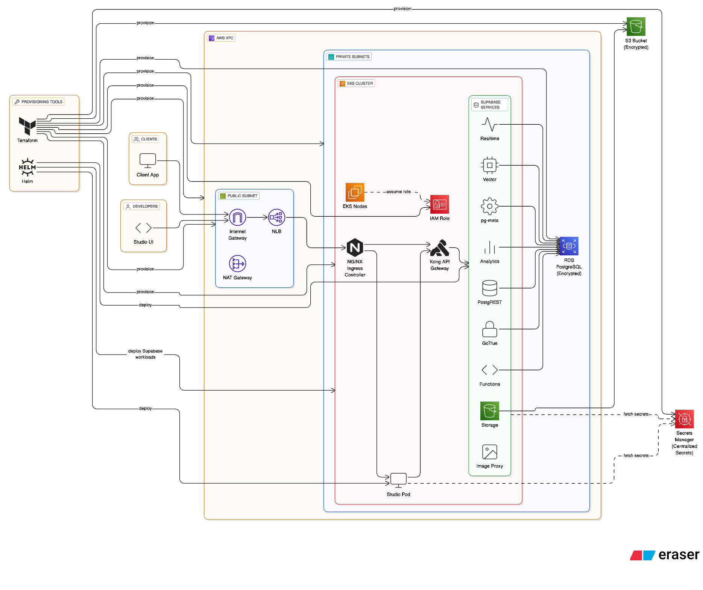

# Supabase on AWS with Terragrunt

Production-ready Supabase deployment on AWS EKS using Terraform and Terragrunt. Includes managed PostgreSQL, monitoring with Prometheus & Grafana, and secure secrets management.



## 🏗️ Architecture

- **EKS Cluster**: Managed Kubernetes for Supabase services
- **RDS PostgreSQL**: Managed database with HA
- **VPC & Networking**: Secure network with public/private subnets
- **S3 Storage**: Object storage for Supabase
- **Monitoring**: Prometheus, Grafana, cert-manager
- **Ingress**: NGINX with SSL/TLS termination

## 📋 Prerequisites

```bash
# Install required tools (macOS)
brew install terraform terragrunt awscli kubectl helm tflint infracost
pip install pre-commit && pre-commit install

# Configure AWS
aws configure
```

## 🚀 Quick Start

```bash
# 1. Clone and setup
git clone <repository-url>
cd supabase-on-aws-terragrunt
make init


# 3. Deploy infrastructure
make plan
make apply

# And deploy Supabase
make plan-supabase && make apply-supabase
```

## ⚙️ Account Configuration

Update `live/prod/account.hcl` with your AWS account details:

```hcl
locals {
  account_name       = "prod"
  account_id         = "XXXXXXXXX"  # Your AWS Account ID
  remote_bucket_name = "supabase-infra-backend"  # S3 bucket for Terraform state
}
```

**Requirements:**
- AWS Account ID must have permissions to create EKS, RDS, VPC, and S3 resources
- You can customize the bucket name for storing infrastructure state
- Terragrunt will auto-create the state bucket and DynamoDB table

## 🛠️ Available Commands

```bash
# Infrastructure
make init validate plan apply destroy
make plan-supabase apply-supabase  # Supabase only

# Maintenance
make fmt lint clean cost

# Configuration overrides
make plan TF_PATH=/usr/local/bin/terraform
make apply PARALLELISM=2
```

## 📁 Project Structure

```
live/prod/us-east-1/     # Environment configs
├── eks/                 # EKS cluster
├── networking/          # VPC setup
├── rds/                 # PostgreSQL
├── s3/                  # Storage
└── supabase/           # Supabase app

modules/                 # Terraform modules
charts/                  # Helm charts
scripts/smoke-test.sh    # Endpoint testing
```

## 🔧 Configuration

Edit configuration files in `live/prod/us-east-1/*/terragrunt.hcl` for:
- Domain settings (supabase/)
- Database config (rds/)
- Cluster settings (eks/)

## 🧪 Testing & Monitoring

```bash
./scripts/smoke-test.sh                    # Test endpoints
make cost && open cost-report/infracost.html  # Cost analysis
```

## 🚨 Troubleshooting

```bash
# State lock errors
terragrunt force-unlock <lock-id>

# Complete cleanup
make destroy-plan && make destroy && make clean
```

## 🔒 Security

- AWS Secrets Manager for RDS secrets
- TLS/SSL termination at ingress
- Network security groups
- Pre-commit hooks prevent credential leaks
